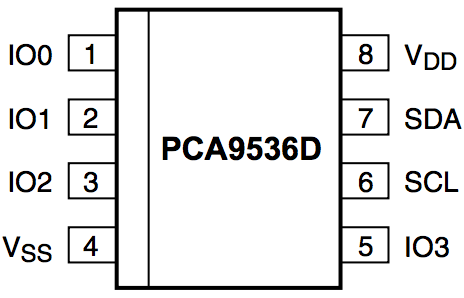

# PCA9536 DRIVER

[](http://www.atmel.com/products/microcontrollers/avr/)
&nbsp;&nbsp;&nbsp;&nbsp;&nbsp;&nbsp;&nbsp;&nbsp;&nbsp;&nbsp;
[](http://semver.org/)
&nbsp;&nbsp;&nbsp;&nbsp;&nbsp;&nbsp;&nbsp;&nbsp;&nbsp;&nbsp;
[](https://cadsoft.io/)
&nbsp;&nbsp;&nbsp;&nbsp;&nbsp;&nbsp;&nbsp;&nbsp;&nbsp;&nbsp;
[](https://opensource.org/licenses/MIT)

## INTRODUCTION

The PCA9536 is a 4-Channel GPIO Expander with a hardware I2C interface.

The device's 4 channels (i.e. I/O pins) may be controlled all at the same time or individually in terms of their:  
\[1\] Mode (INPUT / OUTPUT), \[2\] State (for output pin mode only: HIGH / LOW), and \[3\] Polarity (for input pin mode only: NON-INVERTED INPUT / INVERTED INPUT). The State (LOW / HIGH) of pins in input mode may be read, whereas thoat of pins in output mode may be either read or written to.

This library contains a complete driver for the PCA9536 exposing all the above functionality, as well as allowing uses to toggle the state of pins in input mode, and the option to recieve verbose information re the device's current settings and/or I2C communication results.



Source: [PCA9536 DATASHEET](http://www.nxp.com/documents/data_sheet/PCA9536.pdf)

## REPOSITORY CONTENTS

- **PCA9536.h** - Library Header file.
- **PCA9536.cpp** - Library Compilation.
- **/utility** 
  - **PCA9536InfoStr.h** - Header file containing a functional extention of the library to include generating pritable information String (see Note #5 below).
  - **PCA9536ComStr.h** - Header file containing a functional extention of the library to include generating a pritable I2C Communication Result String (see Note #6 below).
  - **PCA9536_PString.h** - Header file for PString class (lighter alternative to String class) 
  - **PCA9536_PString.cpp** - Compilation file for PString class (lighter alternative to String class) 
- **/examples**  
  - **/PCA9536_Test**
    - **PCA9536_Test.ino** - A basic sketch for testing whether the PCA9536 is hooked-up and operating correctly.
  - **/PCA9536_Usage**
    - **PCA9536_Usage.ino** - A much more extensive sketch offering a complete usage illustration, as well as a rubust testing mechanism.
  - **/PCA9536_Info**
    - **PCA9536_Info.ino** - A short sketch showing how to generate a Printable Device Information String of the PCA9536's current settings (i.e. Configuration, Limit &anp; Hysteresis registers, etc.).
  - **/PCA9536_I2C_Status**
    - **PCA9536_I2C_Status.ino** - A short sketch for verifying I2C communication has been established between the controller and the PCA9536.
- **/extras** 
  - **License.txt** - A cope of the end-user license agreement.  
  - **/eagle**
    - **PCA9536.sch** - Schematic file for the PCA9536 breakout board.
    - **PCA9536.brd** - Board layout file for the PCA9536 breakout board.
  - **/images**
    - **pca9536_pinout.png** - Pinout image of the PCA9536.
- **keywords.txt** - Keywords for this library which will be highlighted in sketches within the Arduino IDE. 
- **library.properties** - General library properties for the Arduino's IDE (>1.5) Library Package Manager.
- **README.md** - The readme file for this library.
- **library.json** - JSON file for the Arduino's IDE (>1.5) Package Manager.

## HOOK-UP

PIN 1 (IO0) - connect to device requiring digital I/O pin (or leave unconnected)  
PIN 2 (IO1) - connect to device requiring digital I/O pin (or leave unconnected)  
PIN 3 (IO2) - connect to device requiring digital I/O pin (or leave unconnected)  
PIN 4 (GND) - Connect to Arduino GND  
PIN 5 (IO3) - connect to device requiring digital I/O pin (or leave unconnected)  
PIN 6 (SCL) - Connect to Arduino Pin A5 with a 2K2 (400MHz) or 10K (100MHz) pull-up resistor  
PIN 7 (SDA) - Connect to Arduino Pin A4 with a 2K2 (400MHz) or 10K (100MHz) pull-up resistor  
PIN 8 (VCC) - Connect to Arduino 5V output  
DECOUPING   - Connect a 0.1uF Ceramic Capacitor between the PCA9536's VCC & GND pins  

## GENERAL NOTES

1) __I2C Communications Library Dependency__

This library depends on the Arduino IDE's native '[Wire](https://github.com/arduino/Arduino/tree/master/hardware/arduino/avr/libraries/Wire)' library for I2C communication between the Arduino (Master) and the PCA9536 (Slave). 

2) __INPUT &amp; OUTPUT REGISTER VALUES__

It is important to note that the PCA9536 uses an inverse value scheme for designating INPUT and OUTPUT modes than that of the Arduino. In the Arduino environment, INPUT is designated by 0 and OUTPUT by 1, whereas the PCA9536 has INPUT as 1 and OUTPUT as 0.

3) __PULL-UP RESISTORS__

All 4 channels of the PCA9536 have weak pull-up resistors attached (~100K). Hence, if a pin is left 'floating' (or unconnected), it will default to a HIGH state.

4) __Constructor &amp; Destructor__

As PCA9536 instances are initialized without parameters (recall that the single I2C address of the device is factory hardwired), the constructor and destructor have a slightly unconventional format in that they do not include the usual parentheses at the end. For concrete illustrations, see the example sketches bundled in this library.

5) __Device Information String__

It is possible to extend the PCA9536 Library to include a function for generating a pritable device information string showing all the relevant details about the devices current settings. As the additional functionality comes at the cost of increased memory footprint, it was implemented as an optional add-on rather than added directly to the core PCA9536 Library. See the [PCA9536_Info](https://github.com/nadavmatalon/PCA9536/blob/master/examples/PCA9536_Info/PCA9536_Info.ino) example sketch for detailed explanation and an actual usage demo.

6) __Device I2C Communications String__

It is also possible to extend the PCA9536 Library to include a function for generating a pritable I2C Communications string showing the result of each I2C transaction in a human-friendly way, something that may be useful, for example, during debugging sessions. As the additional functionality comes at the cost of increased memory footprint, it was implemented as an optional add-on rather than added directly to the core PCA9536 Library. See the [PCA9536_I2C_Status](https://github.com/nadavmatalon/PCA9536/blob/master/examples/PCA9536_I2C_Status/PCA9536_I2C_Status.ino) example sketch for detailed explanation and an actual usage demo.

## I2C ADDRESS

The PCA9536 has a single I2C address (factory hardwired):

| PART NO.  | BIN      | HEX  | DEC | MARKING |
|-----------|----------|------|-----|---------|
| PCA9536D  | 01000001 | 0x41 | 65  | PCA9536 |


## LIBRARY INSTALLATION & SETUP

Begin by installing the library either by using the Arduino IDE's Installation Wizard (Arduino Version >1.5) or simply by directly downloading the library's ZIP folder  from Github, extracting it, and copying the extraxcted folder into your Arduino '/libraries' folder (don't forget to re-start the Arduino IDE after coping the folder so that the new library will show up in the list of installed libraries).


Next, include the library at the top of the sketch as follows:

```
#include "PCA9536.h"
```

At this point you can construct a new PCA9536 instance(s) by using the following command (place at the top of the sketch after the 'include' line):

```
PCA9536 device_name;  // Notice that the constructor doesn't use parenthesis after device_name! (see Note #3 above)
```

>Replace '__device_name__' above with a name of your choice. As the PCA9536 comes with a single hardwired I2C address, initializations of the class instance is done automatically to that address.

Next, make sure to inlude an instruction for initializing the I2C Bus for the [Wire Library](https://github.com/arduino/Arduino/tree/master/hardware/arduino/avr/libraries/Wire), as follows:

(There's no need to include the Wire Library at the top of the sketch as it's already included by the PCA9536 Library)

```
void setup() {
    Wire.begin();
    // ...other setup code...
}
```

## LIBRARY FUNCTIONS

With the library installed & included in the sketch, and an PCA9536 instance created, the following functions are available (see the usage example sketch for a detailed implementation):

__Note About Methods' Return Values:__  
All 'get' methods return some sort of value (e.g. temp reading, hysteresis setting, etc.), while all 'set' methods return nothing. Nevertheless, ALL methods implicitly update the library's __I2C _comBuffer__ (=communication buffer) after each I2C transmission. The reason for this functional design is to maintain structural coherance between the 'get' and 'set' methods. As 'get' methods cannot return both the desired value and the I2C transmission's result simultaniously. Consequently, if the relevant value hasn't been obtained by a particular 'get' method, the user can simply check the content of the _comBuffer to see what error occured. Similarly, it is possible to check if a particular setting has been successfully applied via a 'set' method either by preforming the corresponding 'get' method - e.g. getHystC() after using setHystC() - or by checking the content of the _comBuffer (0 indicates a successful transmission, 1-6 indicate an error as listed below). 

__ping();__                                  
Parameters:&nbsp;&nbsp;&nbsp;None  
Description:&nbsp;&nbsp;&nbsp;Searches for the PCA9536 at the pre-defined I2C Bus address &amp; returns byte with the relevant success/error code, as follows:  
0  ... Success (no error)  
1  ... Buffer overflow  
2  ... Address sent, NACK received  
3  ... Data send, NACK received  
4  ... Other error (lost bus arbitration, bus error, etc.)  
5  ... Timed-out while trying to become Bus Master  
6  ... Timed-out while waiting for data to be sent  
\>6 ... Unlisted error (potential future implementation/s)<br>

Returns:&nbsp;&nbsp;&nbsp;&nbsp;&nbsp;&nbsp;&nbsp;&nbsp;&nbsp;byte  

__getMode();__  
Parameters:&nbsp;&nbsp;&nbsp;IO0 / IO1 / IO2 / IO3  
Description:&nbsp;&nbsp;Gets the selected pin's current mode (1 = INPUT [default]/ 0 = OUTPUT) (For more info, see General Note #1 above).  
Returns:&nbsp;&nbsp;&nbsp;&nbsp;&nbsp;&nbsp;&nbsp;&nbsp;byte  

__getState();__  
Parameters:&nbsp;&nbsp;&nbsp;IO0 / IO1 / IO2 / IO3  
Description:&nbsp;&nbsp;Gets the selected pin's current state (0 = LOW / 1 = HIGH [default]).  
Returns:&nbsp;&nbsp;&nbsp;&nbsp;&nbsp;&nbsp;&nbsp;&nbsp;byte  

__getPolarity();__  
Parameters:&nbsp;&nbsp;&nbsp;IO0 / IO1 / IO2 / IO3  
Description:&nbsp;&nbsp;Gets the selected INPUT pin's current polarity (0 = NON-INVERTED [default] / 1 = INVERTED). Note that this is relevant only for INPUT pins. The polarity setting determinwes whether reading an INPUT pin returns its actual state or an inverted state.  
Returns:&nbsp;&nbsp;&nbsp;&nbsp;&nbsp;&nbsp;&nbsp;&nbsp;byte  

__setMode();__  
Parameters:&nbsp;&nbsp;&nbsp;To set a single pin: IO0 / IO1 / IO2 / IO3, IO_INPUT [default] / IO_OUTPUT | To set all pins at once: IO_INPUT [default] / IO_OUTPUT  
Description:&nbsp;&nbsp;Sets the selected pin/s mode (INPUT / OUTPUT).  
Returns:&nbsp;&nbsp;&nbsp;&nbsp;&nbsp;&nbsp;&nbsp;&nbsp;None

__setState();__  
Parameters:&nbsp;&nbsp;&nbsp;To set a single OUTPUT pin: IO0 / IO1 / IO2 / IO3, IO_LOW / IO_HIGH [default] | To set all OUTPUT pins at once: IO_LOW / IO_HIGH [default]
Description:&nbsp;&nbsp;Sets the selected pin/s state (LOW / HIGH). Note that this is relevant only for OUTPUT pins.   
Returns:&nbsp;&nbsp;&nbsp;&nbsp;&nbsp;&nbsp;&nbsp;&nbsp;None

__toggleState();__  
Parameters:&nbsp;&nbsp;&nbsp;To toggle the state of a single OUTPUT pin: IO0 / IO1 / IO2 / IO3 | To toggle all OUTPUT pins at once: None
Description:&nbsp;&nbsp;Toggles the selected pin/s state (LOW / HIGH). Note that this is relevant only for OUTPUT pins.   
Returns:&nbsp;&nbsp;&nbsp;&nbsp;&nbsp;&nbsp;&nbsp;&nbsp;None

__setPolarity();__  
Parameters:&nbsp;&nbsp;&nbsp;To set a single INPUT pin: IO0 / IO1 / IO2 / IO3, IO_NON_INVERTED [default] / IO_INVERTED | To set all INPUT pins at once: IO_NON_INVERTED [default] / IO_INVERTED  
Description:&nbsp;&nbsp;Sets the selected pin/s polarity (NON-INVERTED / INVERTED). Note that this is relevant only for INPUT pins.  
Returns:&nbsp;&nbsp;&nbsp;&nbsp;&nbsp;&nbsp;&nbsp;&nbsp;None  

__reset();__  
Parameters:&nbsp;&nbsp;&nbsp;None  
Description:&nbsp;&nbsp;&nbsp;Resets all 4 channels of the PCA9536 to their power-up default settings, as follows:  

* MODE: INPUT
* STATE: HIGH
* POLARITY: NON-INVERTED
* REGISTRY POINTER: INPUT

Returns:&nbsp;&nbsp;&nbsp;&nbsp;&nbsp;&nbsp;&nbsp;&nbsp;&nbsp;None  

__getComResult();__  
Parameters:&nbsp;&nbsp;&nbsp;None  
Description:&nbsp;&nbsp;Returns the latest I2C Communication result code (see Success/Error codes above)  
Returns:&nbsp;&nbsp;&nbsp;&nbsp;&nbsp;&nbsp;&nbsp;&nbsp;byte  

__Destructor__  
If you want to destruct an instantiated PCA9536 object, you can use the following method to do so:  

```
~PCA9536 device_name;      // Notice that the deconstructor doesn't use parenthesis after device_name! (see Note #3 above)
```
>__NOTE__: replace the '__device_name__' above with the name of your PCA9536 device.

## Extended Functionality*

(* requires an additional '\#include' of the relevant *.h file as shown in the corresponding example sketches)

__PCA9536ComStr();__  
Parameters:&nbsp;&nbsp;&nbsp;Name of an initialized PCA9536 instance  
Description:&nbsp;&nbsp;Returns printable string containing human-friendly information about the device's latest I2C communication result  
Returns:&nbsp;&nbsp;&nbsp;&nbsp;&nbsp;&nbsp;&nbsp;&nbsp;PString

__PCA9536InfoStr();__  
Parameters:&nbsp;&nbsp;&nbsp;Name of an initialized PCA9536 instance  
Description:&nbsp;&nbsp;Returns printable string containing detailed information about the device's current settings   
Returns:&nbsp;&nbsp;&nbsp;&nbsp;&nbsp;&nbsp;&nbsp;&nbsp;PString

## RUNNING THE EXAMPLE SKETCHES

1) Start the Arduino IDE and open the relevant example sketch  
2) Hook-up the PCA9536 to the Arduino as explained in the sketch's notes  
3) Upload the sketch to the Arduino  
4) Open the Serial Communications Window (make sure the baud-rate is set to 9600 or change it in the sketch to match your Serial Port's buad-rate)  

## BUG REPORTS

Please report any issues/bugs/suggestions at the [Issues](https://github.com/nadavmatalon/PCA9536/issues) section of this Github repository.

## TODO

## VERSION HISTORY

__Ver. 1.0.0__ - First release (24.10.16)  

## LICENSE

[The MIT License (MIT)](https://opensource.org/licenses/MIT)
Copyright (c) 2016 Nadav Matalon

Permission is hereby granted, free of charge, to any person obtaining a copy of this software and associated documentation files (the "Software"), to deal in the Software without restriction, including without limitation the rights to use, copy, modify, merge, publish, distribute, sublicense, and/or sell copies of the Software, and to permit persons to whom the Software is furnished to do so, subject to the following conditions:

The above copyright notice and this permission notice shall be included in all copies or substantial portions of the Software.

THE SOFTWARE IS PROVIDED "AS IS", WITHOUT WARRANTY OF ANY KIND, EXPRESS OR IMPLIED, INCLUDING BUT NOT LIMITED TO THE WARRANTIES OF MERCHANTABILITY, FITNESS FOR A PARTICULAR PURPOSE AND NONINFRINGEMENT. IN NO EVENT SHALL THE AUTHORS OR COPYRIGHT HOLDERS BE LIABLE FOR ANY CLAIM, DAMAGES OR OTHER LIABILITY, WHETHER IN AN ACTION OF CONTRACT, TORT OR OTHERWISE, ARISING FROM, OUT OF OR IN CONNECTION WITH THE SOFTWARE OR THE USE OR OTHER DEALINGS IN THE SOFTWARE.

